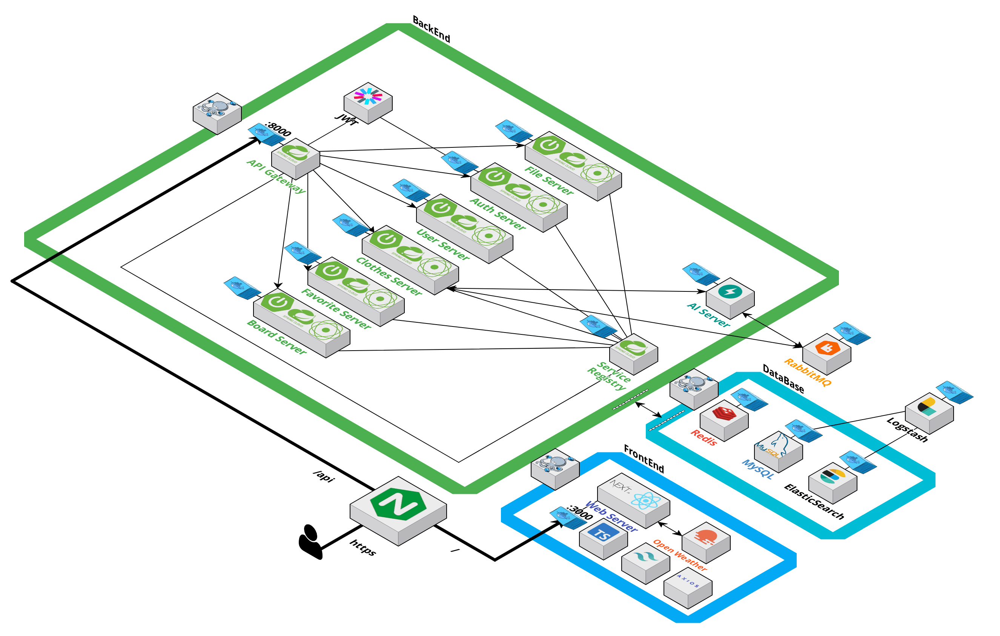
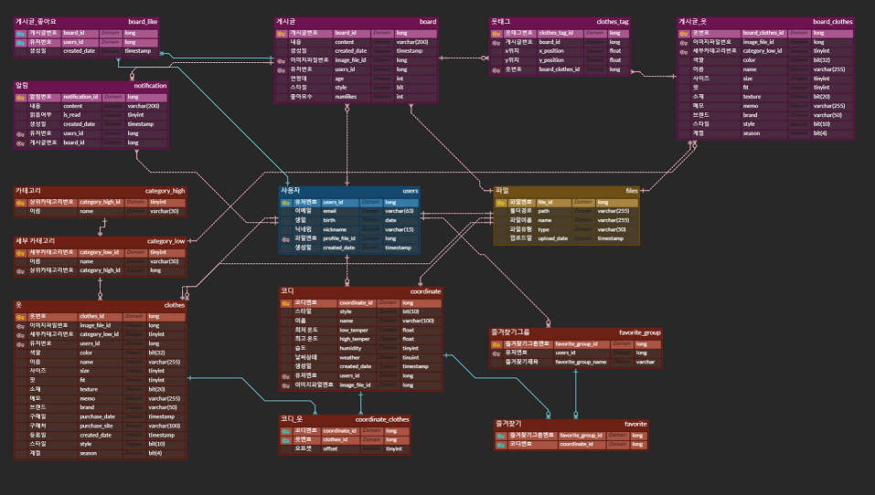

# 옷짱 : OZZ

**2024.07.02 (월) ~ 2024.08.19 (금)**  
**삼성 청년 소프트웨어 아카데미 11기 공통 프로젝트**  
**11기 공통 8반 우수 프로젝트**

## 팀원 구성

| 　**[이보연](https://github.com/btothey99)👑**　 | **[김혜인](https://github.com/meinnn)** |  **[서종원](https://github.com/styughjvbn)**   | **[김하연](https://github.com/gimhyn)** | **[이동엽](https://github.com/doongyeop)** |
| :--------------: | :--------: | :-----------: | :--------: | :--------: |
|  **FRONT & PM**  | **FRONT**  | **BACK & AI** | **FRONT**  |  **BACK**  |

## 기획 배경

**개요**

- 한줄 설명 : 내 옷장에 있는 옷으로 가상 코디 해보기
- 서비스 명 : **옷짱 : OZZ**

**목적**

- **옷장은 가득 차 있는데, 오늘 무엇을 어떻게 입어야 할지 모르겠다**는 사용자들의 고민을 해결하기 위해 개발하였습니다.

## 서비스 구조

### 아키텍쳐

### ERD

### 주요 기술

**개발 환경**

**Development**

  

  

  

**AI**  

**CI/CD**

**협업**

## 서비스 기능

**소셜 로그인**
 

 

**개인 정보 변경**
 

 

**쇼핑몰 구매목록에서 옷 정보 가져와서 등록하기 (AI)**
 

 

**옷 직접 등록하기 (속성 추출하기, AI)**
 

 

**유의어 검색**
 

 

**추천 코디 (AI)**
 

 

**직접 코디해보기**
 

 

## 후기

**보연**

> 이번 프로젝트는 높은 목표를 설정하고 시작했습니다. 수상을 목표로 했던 만큼, 충분한 경험을 쌓아야 한다는 생각이 강했습니다. 웹 프로젝트에 경험이 부족했었지만, 팀원들의 협조와 도움 덕분에 크게 성장할 수 있었습니다.  이번 공통 프로젝트를 통해 많은 것을 배웠습니다. 특히 개발자로서 중요한 것은 단순히 개발 실력뿐만 아니라, 프로젝트 스케줄링 능력도 필수적이라는 점을 깨달았습니다. 이번에 Jira를 활용해 체계적인 스케줄링 방법을 익히게 되어 매우 뜻깊었습니다. 또한, 매일 팀원들과 진행 상황을 공유한 것이 프로젝트의 진행 속도와 완성도를 높이는 데 큰 도움이 되었다고 생각합니다.  이번 프로젝트를 통해 많은 것을 배웠고, 성장할 수 있었습니다. 특히 팀장으로서 여러 부족한 점이 있었음에도 불구하고, 팀원들이 잘 따라와 주고 협력해 준 덕분에 좋은 결과를 얻을 수 있었습니다. 이 자리를 빌려 함께 노력해 준 팀원들에게 진심으로 감사의 마음을 전하고 싶습니다. 😀

**혜인**

> 처음 사용하는 기술, 처음 함께하는 팀원들이라 걱정이 많았음에도, 좋은 결과물이 나와 주어 감개무량합니다. (ㅠㅠ)    무엇보다 소통과 기록의 중요성을 느낄 수 있었던 6주였습니다. 기획과 설계서 등 개발적 공유 사항 외에도 회의, 매일 진행 정도를 기록하며 진행한 것이 전체 프로젝트 진행률을 파악하고 팀원끼리 소통하는 데에 많은 도움이 되었습니다.   새로운 기술을 제안해도 거부감 없이 받아들여 주고, 진행 내내 우쭈쭈 해준 우리 팀원들 정말 고맙습니다!! (❤)

**종원**

> 기술 스택에 익숙하지 않았지만, 새로운 도전을 통해 자신감을 얻을 수 있었습니다. 또한, 백엔드와 프론트엔드 간의 원활한 협업을 위해 목업과 API 설계서와 같은 문서 작성이 필수적임을 깨달았습니다. 이번 경험은 여러모로 많은 배움을 준 소중한 시간이었습니다.

**하연**

> 첫 프로젝트라 처음 해보는 것 투성이었지만 역량이 훌륭한 팀원들을 만나 멋진 결과물을 내놓을 수 있어 감사하고 뿌듯합니다. 하면서 어려움도 많았지만 긍정적인 팀원들 덕분에 잘 헤쳐나갈 수 있었던 것 같습니다. 부족한 팀원을 배려해준 팀원들 덕분에 많이 배우고 즐겁게 프로젝트 했습니다. 특히 발표 앞두고 35시간 동안 팀원들과 붙어있으며 마지막 마무리하던 경험은 정말 잊지 못할 것 같습니다.    늘 굿모닝 인사로 아침을 열어주고 프론트뿐만 아니라 팀 전체 스케줄링 잘 해준 팀장 보연, 멋진 디자인과 새로운 기술 불어 넣어준 혜인, 늘 유쾌한 분위기 만들어주고 인증과 싸우느라 고생한 동엽, 기대를 저버리지 않고 코디 추천의 긴 여정 잘 해낸 종원 모두 고맙습니다.    ❤ 커피4조 최고! 어디 손보여도 자랑스러운 OZZ 최고! ❤

**동엽**

> 이번 프로젝트는 두 번째 도전이어서, 처음 시도하는 부분이 많아 기대와 걱정이 컸습니다. 하지만 훌륭한 팀원들을 만나 함께 협력하며 많은 것을 배우고 성장할 수 있었습니다.
>   
> 기획과 설계 단계에서 충분한 시간을 투자하고, 꼼꼼하게 문서화하는 과정이 초기에는 시간이 많이 걸리는 것처럼 느껴졌지만, 프로젝트를 흔들림 없이 진행하는 데 있어 매우 중요한 요소임을 다시 한번 깨달았습니다.
>   
> 처음 접해보는 Spring Security와 MSA에서 어려움이 있었지만, 팀원들의 도움으로 성공적으로 극복할 수 있었습니다.  함께한 보연, 종원, 혜인 그리고 하연이 정말 고생 많았고, 감사의 마음을 전하고 싶습니다. :>
