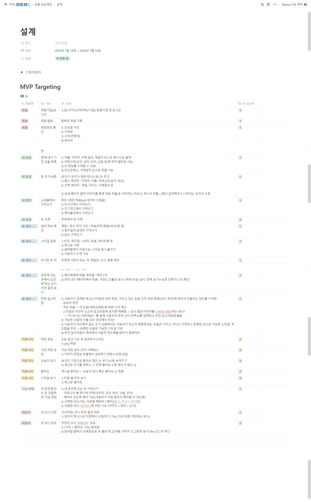
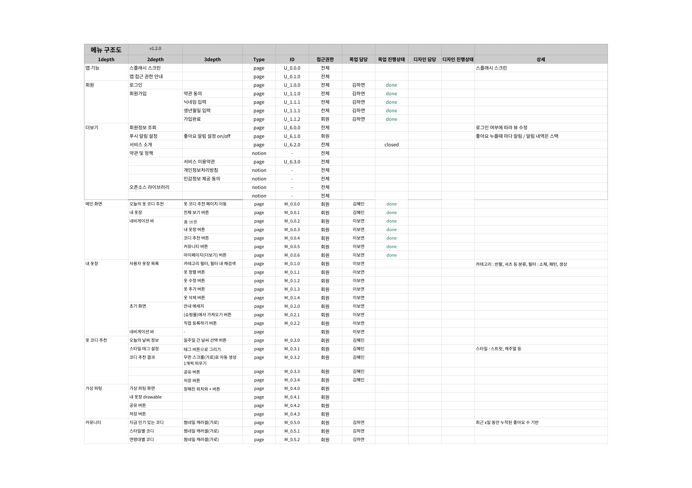
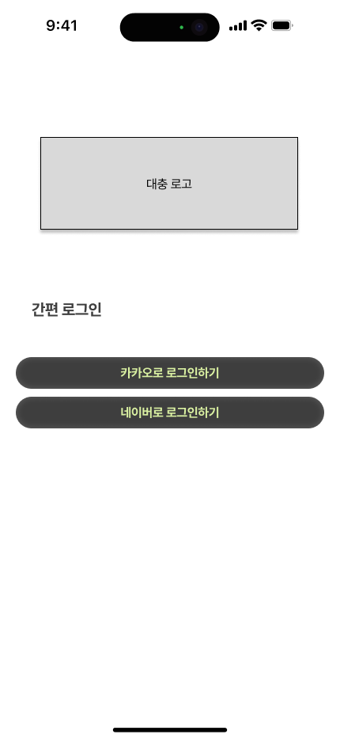
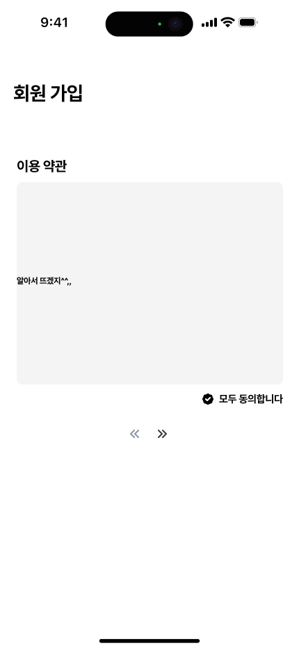
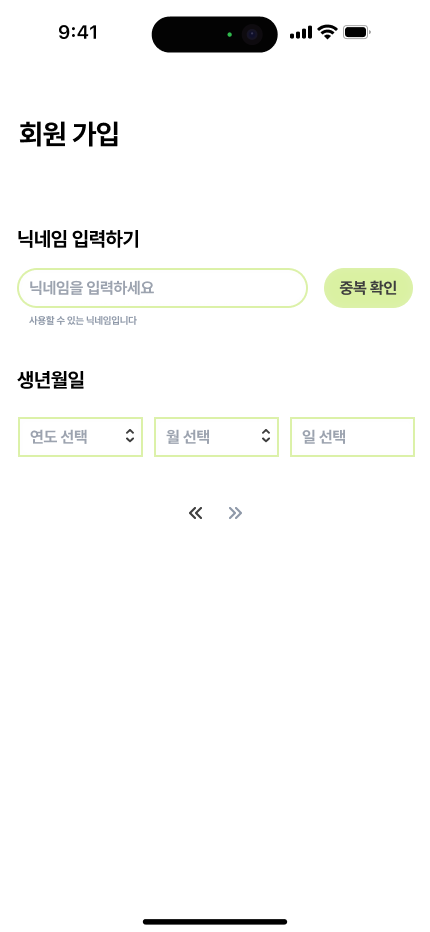
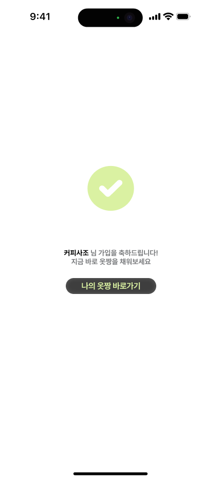

# 2주차 일정표 (07.15 - 07.21)

## 일정표

|    날짜    |                                          팀 목표                                          |    개인 목표    |   기타    |
| :--------: | :---------------------------------------------------------------------------------------: | :-------------: | :-------: |
| 07/14 (일) | `팀 온라인 회의` 방향성 재정비 및 기획 회의   `팀 온라인 회의` 아이디어 선정 및 구체화        | 아이디어 구체화 |           |
| 07/15 (월) |                       컨설턴트님 미팅   기획 선정 및 MVP 타겟팅                           |   기획 구체화   |           |
| 07/16 (화) |                       기능 명세서 작성   ERD 작성 및 검토                                |                 | 면접 공가 |
| 07/17 (수) |                       ERD 검토  API 명세서 작성   목업 만들기                         |  목업 만들기     |           |
| 07/18 (목) |                                                                                           |                 |           |
| 07/19 (금) |                                                                                           |                 |           |

## 07.14 (일)

**팀 회의 진행 (15:00 - 17:00)**

1. **PWA의 백그라운드 GPS 수집 불가 문제**

   - 재기획, 네이티브 앱 전환, GPS 기능 없애기 중 택 1
   - GPS가 핵심 기능이므로 재기획 방향으로 결정

2. **기획 회의**

   - **기존 기획 중 재활용**: 공유 그림판, 내 옷장 관리 서비스
     - 내 옷장 관리 서비스: 초기 데이터 수집 문제를 크롬 익스텐션을 이용해 쇼핑몰 구매 내역 가져오거나, 서비스 내 타사 쇼핑몰 로그인을 통한 크롤링으로 보완
   - **새 기획**: 카카오톡 모임 정산 서비스, 노션 필기 기반 문제 출제 서비스
     - 카카오톡 모임 정산 시스템: 현재 카카오톡에서 지출자가 같은 결제에 대해서만 정산(더치페이) 가능, 모임 차수별로 지출자가 다르더라도 통합 정산 가능하도록 하는 서비스
     - 노션 필기 기반 문제 출제 서비스: 노션에 정리해놓은 개인 필기를 바탕으로 문제 제출, 망각 곡선에 맞춰 푸시 알림으로 복습 유도

3. **기획 구체화**
   - 상대적으로 볼륨 작은 그림판, 정산 서비스 제외 나머지 두 기획 구체화

## 07.15 (월)

1. **컨설턴트님 미팅 (10:00)**
   - 노션 문제집, 옷장 서비스 기반 팀 컨설팅

2. **옷장 관리 및 코디 추천 서비스(옷짱) 구체화 및 MVP 타겟팅**
      

## 07.16 (화)

1. **기능 명세서 작성**

2. **ERD 작성 및 검토**

## 07.17 (수)

1. **ERD 검토**

2. **목업 만들기**

  
  
  
  
  

